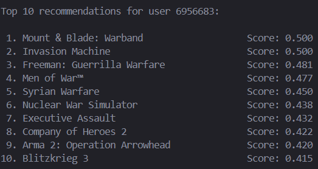

# Spel Rekommendationssystem

I detta projekt utvecklas ett rekommendationsystem på basis av data från spel platformen Steam.

[Data länk](https://www.kaggle.com/datasets/antonkozyriev/game-recommendations-on-steam/data)

## Data

Vi har 4 olika data filer:

- games.csv, innehåller information om spel på steam
- games_metadata.json, innehåller metadata gällande spelen, t.ex. tags
- users.csv, information om steam användare
- recommendations.csv, rekommandtioner från användare på steam

Vi borde kombinera games.csv med games_metadata.json för att lättare kunna ta tags och description. Vi behöver inte kombinera users.csv med recommendations.csv eftersom i det andra datan så finns det färdigt user_id och allt vi behöver men vi borde lite trimma på fil storleken. Recommendations.csv är nästan 2 gb stor eller 41 miljoner rader och kan säkert skapa en väldigt bra rekommendationssystem men vi måste beakta att vi jobbar med inte så bra hårdvara och vi vill komma fram till resultat snabbare.

Users.csv har 14 miljoner användare/rader så vi kan bårt en hel del. Vi minskar mägnden till 1 000 och skapar bins för storlekar på 100.

#### Bins:

(hur många reviews per användare, den tar t.ex. 100 users med reviews mellan 26-35, så här får vi en diverse user base med olika mängder reviews, utan att behöva använda 2gb fil)

(5, 15), (16, 25), (26, 35), (36, 45), (46, 55), (56, 65), (66, 75), (76, 85), (86, 95), (96, 120)

Efter att vi trimmat/slagit ihop filerna har vi dom här filerna i data katalogen:

- games_merged.csv
- users_1000.csv
- recommendations_1000.csv ca. 50 000 rader

## EDA

Vi utforskar vår data.

### Games.csv (games_merged.csv)

**OBS!!!** Vi satt redan ihop games.csv med games_metadata.json för att skapa en tydling och fylld csv fil

- 50872 unika spel
- 15 kolumner, t.ex. app_id, title, date_release mm.
- description kolumnen är den ända av alla data som har inga värde, vi ser till att beakta detta, antingen droppar vi dom eller fyller med något som passar. Spel med ingen description antaglien är inte så värst påbjudande till många

<details>

<summary>Visa Bild</summary>


</details>

### Tomma tags

Fastän i bilden och när vi med kod utforskar finns det tomma tags också. Den är inte 'tom' men den har tomt innehåll.


### Bild kolumner


### Users.csv (users_trimmed.csv)

**OBS!!!** Vi minska vår storlek på hur många users vi har, endast 1 000

- 1.4 miljoner användare i ursprungliga datan, 1 000 efter att vi trimmat
- 3 kolumner: user_id, products (hur många produkter man äger) och reviews (hur många recensioner man gjort)


### Recommendations.csv (recommendations_trimmed.csv)

**OBS!!!** Vi trimmade ner vår data ner så att vi har 50 000 rekommendationer som finns för dom 1 000 användarna i users_trimmed.csv

- 50 000 rekommendationer/rader
- 9 kolumner, app_id


### Visualiseringar

Det ända datasättet som kan utforskas bra visuellt är games.csv, users.csv har endast data i sig inget, intressant att visualisera.

#### Antal spel utsläppta peer år


#### Spel per platform


#### Distribution av spel betyg


#### Hur många reviews finns det per spel


Det kommer antagligen att orsaka ett pupläritets bubble eller partiskhet i detta rekommendationssystem, eftersom mera populära spel har mera recenscioner.

## Innehålls baserad rekommendationssystem

Vi använder tfidf för att gemföra olika spelens egenskaper.

Vi uttnyttjar, spelets tittel och tags som finns i data. Vi håller båda, eftersom ett antal spel har inte tags så då kan vi rekommendera spel i samma franchise.

När man vill ha rekommendationer från ett spel så rekommenderar systemet på basis av hur nära titteln är med sitt namn och tags i gemförelse med andra rekommendera liknande spel.

Vi kan lätt får snabba resultat med det finns inget mera till systemet. Data är också lite bristfällig, många spel har inte tags, då måste vi rekommendera på basis av tittel, vilket kommer att rekommendera spel i samma franchise eller DLC.

### Exempel körning

<details>

<summary>Visa</summary>


Dying Light 2 Stay Human har inga tags så systemet rekommenderar dlc för spelet, vilket är typiskt för steam att också gör.


</details>

Systemet dock är bristfälligt vi rekommenderar spel på basis av hur nära deras tittel + tags är varandra. Detta kan leda lätt till att vi rekommenderar endast spel som är i samma franchise eller dlc när man kanske vill se spel istället.

Det blir klart och tydligt varför ett spel rekommenderas, eftersom om du tycker om Call of Duty så rekommenderar den liknande spel eller andra COD spel. Vi kan också redan börja rekommendera spel, ingen coldstart men de här systemet tar inte i beaktande användar partiskhet och åsikter, det kommer till näst.

## Rekommendationssystem med Samarbetsbaserad filtrering

Vi skapar ett NMF matris på basis av user_id, app_id och rating för att hitta gömda mönster i användarnas beteende.

Det finns ingen egentlig rating kolumn men vi har timmar som spelats och om användaren rekommenderar spelet. Vi kan kombinera dom två och räkna ut en rating på basis av:

$$
\text{score} = 0.7 \times \text{is-recommended} + 0.3 \times \text{hours-played}
$$

Varav score är ett tal mellan 0-1 desto större värde desto bättre rating. Vi sätter stor vikt på om användaren rekommenderar spelet och lite mindre på hur många timmar en har spelat. Här kan man säkert hitta ett bättre sätt att göra det här.

```Python
df["rating"] = (0.7 * df["is_recommended"]) + (0.3 * df["hours_normalized"])
```

Vårt system nu baserar rekommendationer på basis av vad användaren har tyckt om. Vi får då diverse spel och möjligen oförväntade spel som inte alls liknar vad en användare typiskt tycker om. I gemförelse med innehållsbaserat får vi mera diverse tittlar.

Nya användare dock kommer inte att kunna dra nytta av detta, eftersom det inte finns data att jämföra med. Vi har också ett problem med populäritets partiskhet, eftersom populära spel förekommer oftare i datan.

### Exempel Körning

<details>

<summary>Visa</summary>

#### 1 000 användar datan


#### Maybe remove

#### 10 000 användar datan


</details>

## Hybrid-Rekommendationssystem

I hybrid.py har vi implementerat ett hybrid rekommendationssystem som kombinerar våra två tidigare rekommendationssystem/strategier:

1. Kollaborativ/Samarbetsbaserad filtrering (CF)

2. Innehålsbaserad filtrering (CB)

Med att kombinera dessa uppnår vi ett mera balanserat rekommendationssystem.

Systemet går igenom alla spel användaren spelat eller recenserat och gör rekommendationer baserat på det (exkluderar redan ägda/spel som interagerats med) (_tidigare version se kommentar om ändring nedan_).

I systemet kan man lägga olika vikt på CF och CB för bättre resultat. Balansen styrs av α (alfa), α=1 fullt fokus på CF, α=0 fullt fokus på CB. Följer följande formel:

$$
\text{final-score}(u,i) = \alpha \cdot CF-score(u,i) + (1-\alpha) \cdot CB-score(i)
$$

Resultaten av CF och CB normaliseras före kombinationer för att få jämförbara skalor:

```Python
def normalize_scores(self, scores_dict):
        if not scores_dict:
            return scores_dict
        max_score = max(scores_dict.values())
        if max_score == 0:
            return {k: 0 for k in scores_dict}
        return {k: v / max_score for k, v in scores_dict.items()}
```

```Python
collab_scores = self.normalize_scores(collab_scores)
content_scores = self.normalize_scores(content_scores)
```

Gjorde mot slutet ändring i Hybrid rekommendationssystemet så att den rekommenderar på basis av ett gillat spel för användaren istället för alla gillade spel.

Den kör då snabbare och speciellt evaluering blir effektivare.

Resultaten blir det samma men är snabbare.

### Resultat

Resultat med α = 0.8


Vi tar en annan körning där vi jämför med det kollaborativa systemet.


Intressant nog så föreslår den samma spel som kollaborativa men i annan ordning. Inte överraskande att den ger samma spel då det är mera vikt på kollaborativa med alfa = 0.8. Däremot om vi ändrar alfa till 0.5 istället så får vi också andra spel i resultat då den satsar lika mycket på innehållsbaserade systemet.



## Evaluering och verifikation

I evaluering har vi funktioner för att räkna Precision@k, coverage och novelty för hybrid rekommendationssystemet.

Att notera för dessa mått är att precision kommer alltid bli 0 eftersom vi exkluderar spel från rekommendationerna som användaren intereagerat med (spelat eller rekommenderat). Coverage är lågt för att det finns en så stor katalog av spel i jämförelse till mängd spel som rekommenderas. Novelty blir också högt på grund av katalogstorleken. Det kan finnas mera opopulära spel än populära spel i katalogen.

Just nu kör evaluator.py väldigt väldigt långsamt. Detta för att den kör igenom rekommendationer för så många användare.

För att optimera borde man hitta på sätt att köra igenom rekommendationsystemet snabbare. 

Ett sätt att förbättra hastighet kunde vara att försöka köra igenom användare parallelt.

Slutliga lösningen var att rekommendationer är på basis av ett gillat spel istället för användarens alla gillade spel.

### Evaluerings Resultat

Resultat för 1000 användare, där mängden spel som rekommenderas per användare är 5. (Kör väldigt långsamt)


Resultat då man rekommenderar baserat på ett gillat spel (också 5 rekommendationer per användare). (Kör snabbt)
Vi får lägre coverage eftersom vi inte utgår från alla spel användare gillat.


10 rekommendationer per användare:


## Analys och tankar

Vi har från grunden utvecklat detta system med mål att lära oss om dessa system, inte skapa det bästa och mest invecklade systemet som finns.

Datan vi har är bristfällig på flera sätt:

- Beskrivningar/Description samt tags saknas från många spel i datan
- Många användare med inga recensioner eller mindre än 5
- Datan innehåller inte bara spel utan också DLC/Downloadable content som inte är spel
- Populäritets bias/partiskhet, för många spel rekommenderas för mycket, det skapas en bubbla
- För stor data för oss att jobba med, vilket ledde till att vi minska på datan, egentligen inte en dålig sak men för detta projekt måste vi trimma på det om vi ville kunna jobba med det

Ett sätt och göra allting bättre skulle vara att förbättra datan. Vi skulle också kunna, om möjligt, lägga till en önskelista och använda den för att rekommendera, men beakta populära spel.

Innehållsbaserade systemet är ganska långt så bra som den kan vara, vi skulle kunna ta med beskrivning/description, men det verkar börja bli för mycket att gemföra och texterna är inte alltid av samma kvalitet eller beskriver inte på samma sätt sina spel, samt att det fanns många tomma beskrivningar. Vissa spel hade inga tags så datan borde egentligen förbättras för detta ändamålet. Vi kan testa med att använda andra metoder i stället för TfIdf, t.ex. andra NLP metoder, word frequency etc. eller djupinlärning.

Sammarbetsbaserade systemet skulle kunna förbättras genom att kombinera flera samarbetsbaserade rekommendationssytem för att skapa ett bättre system eller använda ett helt annat system. Möjilgen också anpassa systemet så att den minskar på rekommendationer av populära spel.

Hybrid systemet är funktionellt och logiken är rätt. Förbättring kunde säkert göras i den ändå för att uppnå bättre resultat och effektivitet. Som nämnt ovan skulle det dels vara att utveckla på de två tidigare systemen. Men optimering av koden och ändringar som att t.ex. preparation av dataframes och bredare utgångspunkt än ett gillat spel kunde förbättra systemet. 

För evalueringen så är det metriker vi mäter inte det bästa passande för vår data och rekommendationssystem. Precision blir alltid 0, coverage ganska lågt för att det är så stort dataset och novelty blir alltid ganska högt (kring 9). För att evaluerings programmet vore mera givande kunde man överväga att ha med andra metriker eller tänka om hur vi räknar/mäter dem vi har.


